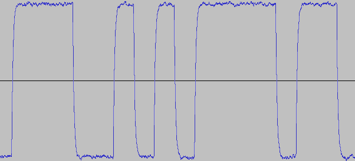

NRZ Decoder
===========

This project provides the scaffold to build a basic non-return-to-zero decoder.



Task
----

The file `decode.py` provides a simple framework and several unit tests for a decoder. It can be invoked as (assuming that your system Python 3 interpretter is `python3`):

```bash
python3 decode.py message.wav
```

Invoked in this way, it will decode the data in `message.wav` and return it as a string.

The tests are implemented as doctests and can be run using:

```bash
python3 -m doctest decode.py
```

They can also be run by invoking `make test` assuming that GNU make or equivelent is in your path.

Protocol Description
--------------------

The included `message.wav` file is a playable sound file that encodes a message using the following scheme (very similar to RS232)

The message is first encoded using UTF-8 and then split into bytes. Prior to sending a byte, a single start bit (0) is transmitted followed by the 8 bits in the byte, beginning with the least significant bit. A stop bit (1) is sent at the end of each byte.

The transmission uses a baud rate of 300.

Useful libraries
----------------

You are free to use the libraries that are best suited to this task. The libraries that I recommend are already imported in `decode.py`. They are:

- [wave](https://docs.python.org/3/library/wave.html) - for reading wave file data a `bytes`
- [bitarray](https://github.com/ilanschnell/bitarray) - for dealing with individual bits
- [struct](https://docs.python.org/3/library/struct.html) - for translating bytes to values understood by Python
